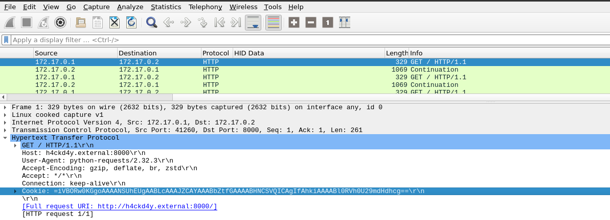
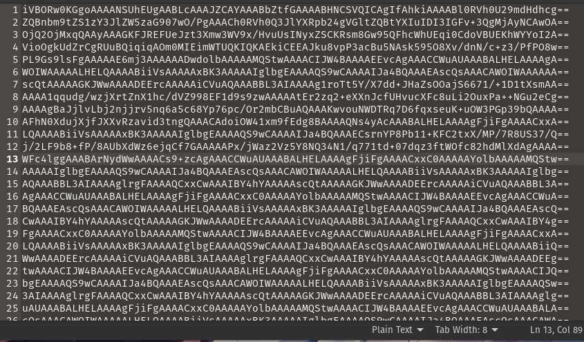
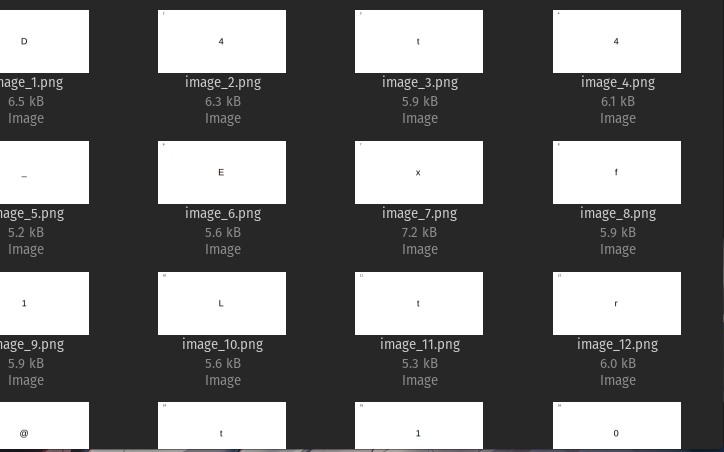

`Writeup Author : Sn4keEy3s`

We are given a pcap file, open it will give us  a lot of http requests with a wierd cookie chunk that contains a base 64 strings.

Dumping all the data of this cookies.

Dumping the decoded base64 to hex we will see multiple PNG headers, so maybe its holding multiple images.
```python
import base64
import re
import os

def extract_png_images(base64_file, output_dir):
    with open(base64_file, 'r') as file:
        lines = file.readlines()

    bin_data = b'' 
    for line in lines:
        line = line.strip()  
        padding = len(line) % 4
        if padding != 0:
            line += '=' * (4 - padding)
        bin_data += base64.b64decode(line) 

    png_signature = b'\x89\x50\x4E\x47\x0D\x0A\x1A\x0A'
    iend_terminator = b'\x49\x45\x4E\x44\xAE\x42\x60\x82'

    start_pos = 0
    image_count = 0

    while start_pos < len(bin_data):
        print('image count ',image_count)
        # Search for the PNG signature
        start_index = bin_data.find(png_signature, start_pos)

        if start_index == -1:
            print('start index = -1')
            break
           
        end_index = bin_data.find(iend_terminator, start_index)

        if end_index == -1:
            print('end index = -1')

            break

        png_image_data = bin_data[start_index:end_index + len(iend_terminator)]

        image_count += 1
        output_file = os.path.join(output_dir, f"image_{image_count}.png")

        with open(output_file, 'wb') as img_file:
            img_file.write(png_image_data)

        start_pos = end_index + len(iend_terminator)

    print(f"Extracted {image_count} PNG images.")

base64_file = 'extracted.txt'  
output_dir = './im' 
if not os.path.exists(output_dir):
    os.makedirs(output_dir)
extract_png_images(base64_file, output_dir)
```
After extracting the images, each contain a letter of the flag.



