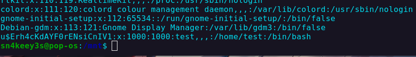

We are given a disk image to analyse.

Description : Inspector Edgar is one of the heads of the London police force. He’s caught many criminals, though he’s never quite understood how he managed to do it. In truth, he’s a bit clumsy and naïve, but not malicious in the slightest. Right before going on vacation, he jotted down his password on a scrap of paper. Upon returning, he tried to log in but, being a bit absent-minded, he forgot his username. Not the best situation for logging in, is it?

Do not run it as a VM it'll change files inside !
By mounting the disk, looking at /etc/passwd we can find the username 

Flag : `HACKDAY{u$Erh4cKdAYF0rENsiCnIV1}`
