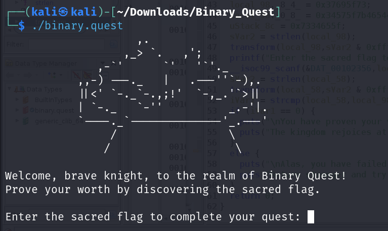
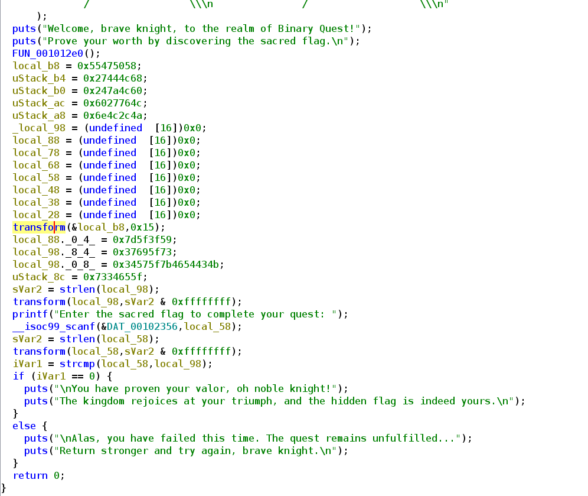
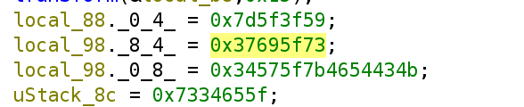
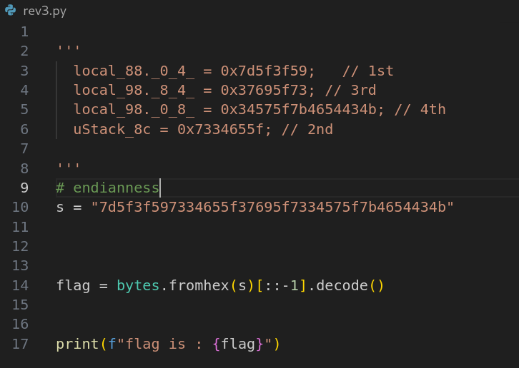
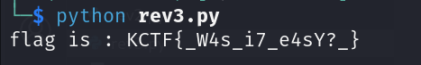

## Description

the challenge provide a elf file that ask you for the flag (flag checker)

## Solution

here is the main funtion :

After reading the main function the most important part is this where we apply a transform funtion to both input flag and a predifined variable.

So the flag is this variable (the real flag is transformed and input flag is also transformed so the initial value is the real flag)

now lets get the flag

Result :

## Flag

`KCTF{_W4s_i7_e4sY?_}`
