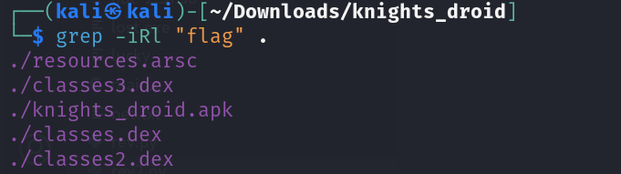
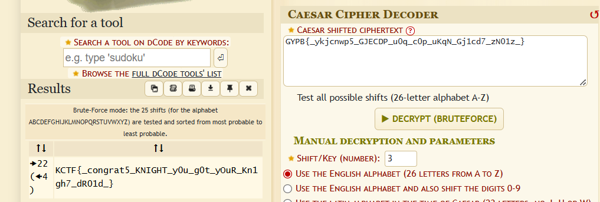

## Description

The challenge give an apk file

## Solution

the easiest solution is to grep for flag string, but before that let's unzip the apk file.

after that lets search for the flag word.

and now after seeing all files on the search result we find this which seems the flag enrypted in the classes3.dex : `GYPB{_ykjcnwp5_GJECDP_u0q_c0p_uKqN_Gj1cd7_zN01z_}`

Its a caesar cipher !!

### flag

`KCTF{_congrat5_KNIGHT_y0u_g0t_yOuR_Kn1gh7_dR01d_}`
