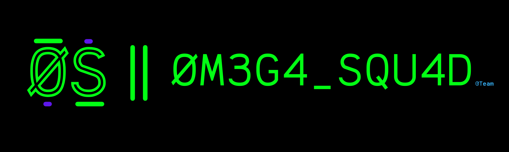

# 🏴‍☠️ 0M3G4-SQU4D CTF Team

## Welcome to 0M3G4-SQU4D
We are a group of cybersecurity enthusiasts who love solving security related problems in the world of Capture The Flag (CTF) competitions. We also provide our services that includes hosting CTFs competitions from challenges creation to the CTF platform deployment.

---

## Connect With Us
- **GitHub**: [@0M3G4-SQU4D](https://github.com/0M3G4-SQU4D)
- **CTFtime**:  
- **Website**: 
  
---

## About Us
- **Founded**: 2024
- **Team Members**: 6 active members
- **Current CTFTime Ranking**: 2nd Place in Morocco
- **Specialties**: Web Exploitation, Reverse Engineering, Binary Exploitation, Cryptography, Digital Forensics, OSINT, Network Security, Steganography

---

## Meet Our Team

### Sn4keEy3s - Forensics, Misc, Jails
Digital forensics master who lives and breathes memory dumps. Expert in malware analysis and memory forensics investigations.

### H1GH_N00N_TW1TCH - Reverse Engineering & Pwn [TEAM LEADER]
Reverse engineering & pwn wizard. The one who turns binaries into art. Specializes in binary exploitation and assembly analysis.

### attendant_of_mysteries - Cryptography
Cryptography wizard who breaks the unbreakable. Master of blockchain technologies and AI lover. Handles mathematical puzzles and cipher breaking.

### bughunter01 - Web Exploitation
Always screams with 'XSS' word in his dream, He is also an LFI Lover. Specializes in web application security and vulnerability assessment.

### 3Eyed_Raven - Web Exploitation & Steganography
Leveling stegano and web hide-and-seek games. Expert in steganography techniques and hidden data extraction.

### DahoBachirRayan - Web Exploitation
Code architect by day, bug bounty hunter by night. Builds secure apps while breaking insecure ones. Software engineer passionate about developing secure applications.

---

## Technical Skills & Expertise

### Core Competencies
- **Web Exploitation**: 70% proficiency
- **Reverse Engineering**: 85% proficiency
- **Binary Exploitation (PWN)**: 70% proficiency
- **Cryptography**: 95% proficiency
- **Digital Forensics**: 95% proficiency
- **OSINT**: 90% proficiency
- **Network Security**: 90% proficiency
- **Steganography**: 85% proficiency
- **Boxes/Machines**: 70% proficiency

### Platforms & Competitions
- **HackTheBox**: Active team - Last Record: 117th / 8000+ teams place at Cyber Apocalypse 2025
- **CTFTime Platform**: Currently 2nd In Morocco top teams
- **Our CTF Platform**: Coming Soon

---

## Achievements

### CTFTime 2025 Ranking
**Position**: 2nd Place in Morocco
**Category**: Overall
Currently 2nd on Moroccan ranking

### Akasec Cyber Odyssey National CTF
**Position**: 2nd Place
**Category**: National
The CTF Where we showed our valuable skills, by getting 2nd Place in the Student Division.

### HackTheBox CyberApocalypse CTF 2025
**Position**: Top 117 - 2nd in Morocco
**Category**: International
117 / 8160 Team, 2nd Place in morocco ranking

### The Hacker Conclave v2 CTF
**Position**: 6th Place
**Category**: International
6th Place at The International Hacker Conclave v2 CTF

### EHAX CTF 2025
**Position**: 15th Place
**Category**: International
15th Place at The EHAX CTF 2025

### IDEH INPT CTF 2025 v6
**Position**: 3rd Place
**Category**: National
Achieved 3rd place at the National IDEH INPT CTF 2025 v6.

---

## Projects & Contributions
- **Write-Ups Repository**: Our solutions and insights from past CTF competitions
- **Team Website**: Comprehensive writeups and cybersecurity resources
- **CTF Hosting Services**: From challenge creation to platform deployment

---

## Competition History
- **CTF Platforms**: HackTheBox, TryHackMe, CTFtime
- **Regular Participation**: Weekly CTF competitions and cybersecurity challenges
- **Team Challenges**: Collaborative problem-solving across multiple security domains

---

## Services Offered
- CTF Competition Hosting
- Challenge Creation and Development
- CTF Platform Deployment
- Cybersecurity Training and Workshops
- Write-ups and Educational Content

---

## GitHub Stats

---

## Team Philosophy
"In cybersecurity, teamwork makes the dream work. Six specialists, one unstoppable force!"

Founded in 2024, 0M3G4-SQU4D continues to grow stronger with each CTF competition, combining individual expertise across all major security domains to tackle the most challenging cybersecurity problems.
