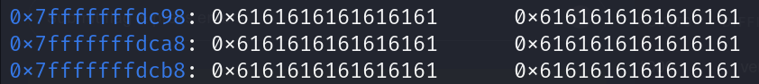

- for the 'shellcode_address' make sure that it point to start of stack address where our payload is there

!! sometime it need some difference between gdb and normal process to work
eample :

- in gdb :
  

- outside gdb :
  shellcode_address = 0x7fffffffdcf8

so in this example the valid address = offset + gdb_address (offset = 96)

!!!!!!!1
when ASLR is activated the shellcode_address will change every time the program is rum
but we can "jmp <register>" where the buffer is stored (in that expamle jmp rsp)
